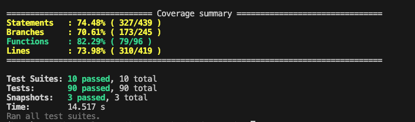
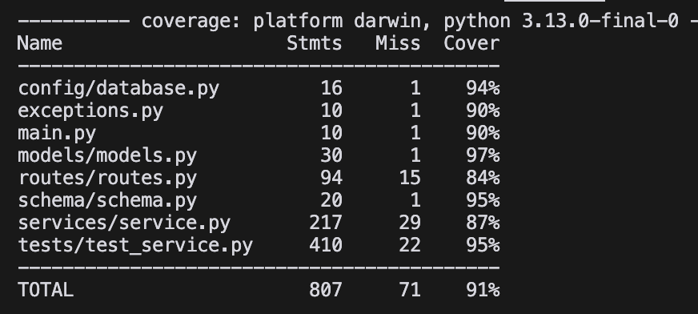

# Briefly

Briefly is a summarization tool designed to help users summarize code, research papers, and documentation efficiently. The application allows users to create, share, and manage summaries seamlessly.

## Video Demo

Link to the video demo can be found [here](https://drive.google.com/file/d/1YHdMjPdJvhQ8gf_kovTG7VFG6a1UuPlk/view?usp=sharing).

## Features

- **User Authentication**: Secure login and registration for users.
- **Summary Creation**: Users can create summaries by uploading files or typing/pasting content.
- **Summary Sharing**: Users can share summaries with other registered users.
- **View Summaries**: Users can view their own summaries and those shared with them.
- **Regenerate Summaries**: Users can provide feedback to regenerate summaries based on their input.

## Technologies Used

- **Frontend**: React, Material-UI
- **Backend**: FastAPI, MongoDB
- **Libraries**: Axios for API requests, PyPDF2 for PDF handling, Mistral for AI summarization

## AI Models Used
- Our tool uses the free-tier Mistral AI API to get access AI models.
- Code Summaries are generated by "Codestral Mamba" model and the rest are generated by "Mistral Nemo" model

## Setup

### Prerequisites

- Node.js and npm (for frontend)
- Python 3.x (any version > 3.12) and pip (for backend)
- MongoDB (for database)

### Frontend Setup

1. Navigate to the frontend directory:
   ```bash
   cd frontend
   ```

2. Install dependencies:
   ```bash
   npm install
   ```

3. Start the development server:
   ```bash
   npm start
   ```

### Backend Setup

1. Navigate to the backend directory:
   ```bash
   cd backend
   ```

2. Create and activate a conda environment:
   ```bash
   conda create --name cs520 python=3.12
   conda activate cs520
   ```

2. Install dependencies: 
   ```bash
   pip install -r requirements.txt
   ```
   
3. Set environment variables:\
   Update the below environment variables in the .env file in the backend folder.
   - SECRET_KEY can be any random string of your choice.
   - DATABASE_URL should have the uri of your MongoDB.
   - MISTRAL_API_KEY should have your Mistral AI API key. If you do not have one, steps to generate a new free tier Mistral AI API key can be found [here](https://docs.mistral.ai/getting-started/quickstart/#:~:text=To%20get%20started%2C%20create%20a,clicking%20%22Create%20new%20key%22.).
   
   **Note** : A mail has been sent to the UMass CS520 instructors with link to the .env file that can be directly used here.  

4. Start the FastAPI server:
   ```bash
   uvicorn main:app --reload
   ```

## Usage

1. **Register/Login**: Users can register or log in to access the application.
2. **Create Summary**: Users can create a new summary by selecting the type and input method (upload or type).
3. **Share Summary**: Users can share their summaries with other users by entering the recipient's email or username.
4. **View Summaries**: Users can view their own summaries and those shared with them.
5. **Regenerate Summary**: Users can provide feedback to regenerate existing summaries.

## API Endpoints
### Authentication
- `POST /user/create`: Register a new user
- `POST /user/verify`: Login user

### Summaries
- `POST /summary/create`: Create a new summary.
- `POST /summary/upload`: Upload a file to create a summary.
- `POST /summary/share`: Share a summary with another user.
- `GET /user/{userId}/shared-summaries`: Fetch all summaries shared with a specific user.
- `GET /summary/{summary_id}`: Fetch a specific summary.
- `DELETE /summary/{summary_id}`: Delete a summary
- `POST /summary/regenerate/{summary_id}`: Regenerate a summary with feedback
- `POST /summary/share`: Share a summary with another user
- `GET /shared-summaries/{user_id}`: Get summaries shared with a user
- `GET /download/{file_id}`: Download original uploaded file

## Testing

### Frontend Testing

1. Navigate to the frontend directory:
   ```bash
   cd frontend
   ```

2. Run the test suites:
   ```bash
   npx jest
   ```

3. Run tests with coverage:
   ```bash
   npx jest --coverage
   ```

   ## Frontend Test Coverage Report:

      

### Backend Testing

1. Navigate to the backend directory:
   ```bash
   cd backend
   ```
   
2. Set python path:
   ```bash
   export PYTHONPATH=.
   ```
   
3. Run the test suite:
   ```bash   
   pytest tests/
   ```

4. Run tests with coverage:
   ```bash
   pytest --cov=. tests/
   ```
   
   ## Backend Test Coverage Report:

   
